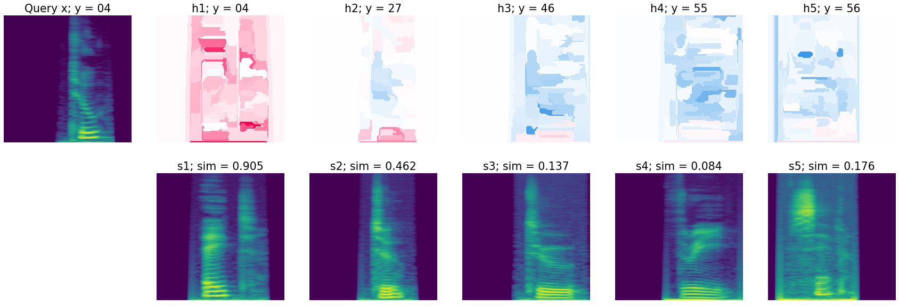

# SINEX
SINEX implementation to explain Siamese Networks.

## Repository Content ##
- [AudioMNIST](https://github.com/soerenab/AudioMNIST) test classes (dataset folder)
- transofmer.py script (code folder) which transforms the audio wav files into spectrograms 
- SINEX, SINEXC explainers implementation (code folder)
- pretrained model (model folder)
- How To Use Jupyter Notebook

**IMPORTANT NOTE**: you must run transformer.py before using the How To Use jupyter notebook!  

## SINEX Usage ##
First, import the package.

```python
from sinex import Sinex
```

Then, set the segmentation algorithm name, the segmentation algorithm parameters and the data input shape.

```python
algo = 'felzenszwalb' # algorithm name
params = {'scale':50, 'sigma':1.5, 'min_size':150}
shape = (224, 224, 1) # data input shape
```

Now you can initialize SINEX

```python
# Initialize sinex
sinex = Sinex(algo, params, shape)
```

Given a query input *x* and a support set *S*, you can use the *explain* method of sinex to get the contribution values for each element of the support set.

```python
# Get SINEX explanations
E = sinex.explain(model, x, S)
```

Here is an example of visualization of the contribution heatmaps given by the *plot_explanation* function defined in the How To Use jupyter notebook. 


You can also update *SINEX* segmentation algorithm and its parameters using the *configure* method.

```python
algo = 'slic'
params = {'n_segments':15, 'compactness':10, 'sigma':1, 'start_label':1 }
 
# Update SINEX parameters
sinex.configure(algo, params, shape)
```

## SINEXC Usage ##
*SINEXC* usage is identical to the one described for *SINEX*.
The only difference is that both the *inizialize* and *configure* methods accepts the additional *alpha* and *beta* parameters. 

```python
from sinexc import Sinexc

algo = 'felzenszwalb' # algorithm name
params = {'scale':50, 'sigma':1.5, 'min_size':150}
shape = (224, 224, 1) # data input shape
alpha = 150 # per-segment coalitions
beta = 0.15 # per-coalition active segments in % value

# Initialize SINEXC
sinexc = Sinexc(algo, params, shape, alpha, beta)

# Get SINEXC explanations
E = sinexc.explain(model, x, S)
```

## Requirements ##
- python 3.9.7
- numpy 1.19.5
- librosa 0.8.1
- tensorflow 2.7.0
- matplotlib 3.5.0
- skimage 0.18.3
- os, blog, copy, random, pickle
